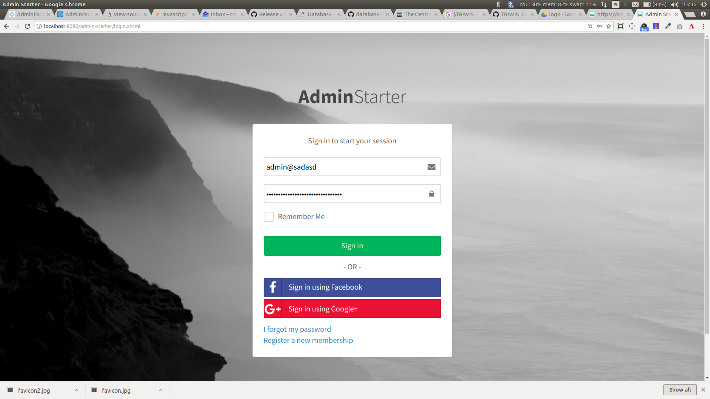
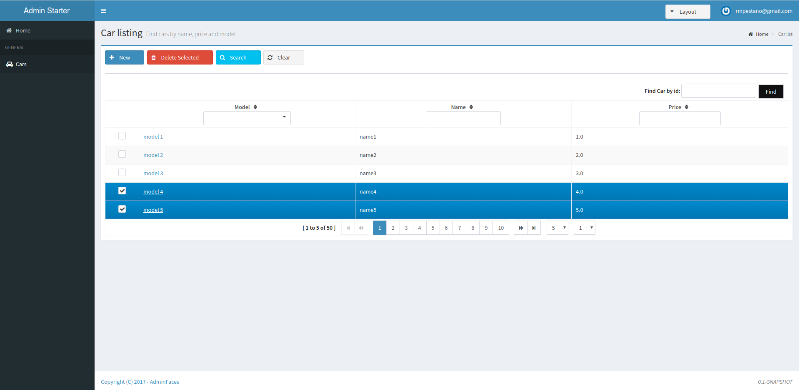
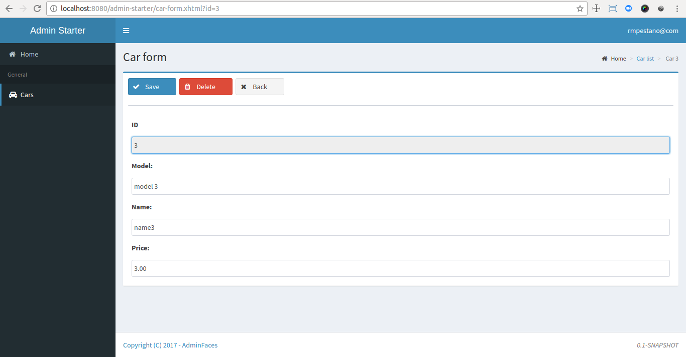

= AdminFaces Starter Persistence
:toc: preamble
:sectanchors:
:sectlink:
:numbered:
:tip-caption: :bulb:
:note-caption: :information_source:
:important-caption: :heavy_exclamation_mark:
:caution-caption: :fire:
:warning-caption: :warning:

image:https://travis-ci.org/adminfaces/admin-starter-persistence.svg[Build Status (Travis CI), link=https://travis-ci.org/adminfaces/admin-starter-persistence]
image:https://sonarcloud.io/api/project_badges/measure?project=com.github.adminfaces:admin-starter&metric=alert_status["Sonar", link="https://sonarcloud.io/dashboard?id=com.github.adminfaces%3Aadmin-starter"]

A simple project to get you started with https://github.com/adminfaces[AdminFaces^] using https://github.com/adminfaces/admin-persistence[Admin Persistence^] for utility persistence layer.

.Login page

.Car list

.Car search
image:starter5.png[link="https://raw.githubusercontent.com/adminfaces/admin-starter-persistence/master/starter5.png"]

.Car form

.Car form responsive
image:starter4.png[link="https://raw.githubusercontent.com/adminfaces/admin-starter-persistence/master/starter4.png"]

== Running

Run `mvn clean package` and deploy on any JavaEE 6 or greater application server.

IMPORTANT: If you are not running on `JBoss/Wildfly` you'll need to configure the datasource declared in https://github.com/adminfaces/admin-starter-persistence/blob/master/src/main/resources/META-INF/persistence.xml[persistence.xml^].

TIP: To run on `Java EE 6` app server you'll need to downgrade OmniFaces to version `2.1`.

You can also run via http://wildfly-swarm.io/[wildfly-swarm^] with command `mvn wildfly-swarm:run -Pswarm`.

Or using docker:

----
docker run -it -p 8080:8080 rmpestano/admin-starter-persistence
----

[TIP]
====

Use the `bash build-and-run.sh` to easily start the application on a docker container.

TIP: To run on `Payara` or `Tomee` just replace Dockerfile content with `Dockerfile-payara` or `Dockerfile-tomee` and run the build-and-run script.

====

The application is available at http://localhost:8080/admin-starter

== Demo

A live demo is available on https://adminfaces.github.io/admin-starter/[Openshift here^]

== Test

To run tests execute following maven command:

* `mvn test -Ptests` for all tests
* `mvn test -Pblackbox` for functional tests
* `mvn test -Pwhitebox` for integration tests

See the following video to see the tests in action: https://youtu.be/9_khZVsDO0Y

