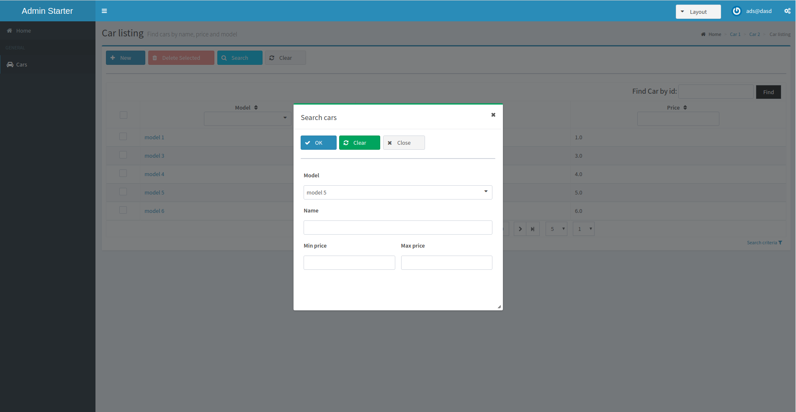

= AdminFaces Starter Persistence

image:https://travis-ci.org/adminfaces/admin-starter-persistence.svg[Build Status (Travis CI), link=https://travis-ci.org/adminfaces/admin-starter-persistence]
image:https://sonarcloud.io/api/project_badges/measure?project=com.github.adminfaces:admin-starter&metric=alert_status["Sonar", link="https://sonarcloud.io/dashboard?id=com.github.adminfaces%3Aadmin-starter"]

A simple project to get you started with https://github.com/adminfaces[AdminFaces^] using https://github.com/adminfaces/admin-persistence[Admin Persistence^] for utility persistence layer.

.Login page
image:starter1.png[link="https://raw.githubusercontent.com/adminfaces/admin-starter-persistence/master/starter1.png"]

.Car list
image:starter2.png[link="https://raw.githubusercontent.com/adminfaces/admin-starter-persistence/master/starter2.png"]

.Car search

.Car form
image:starter3.png[link="https://raw.githubusercontent.com/adminfaces/admin-starter-persistence/master/starter3.png"]

.Car form responsive
image:starter4.png[link="https://raw.githubusercontent.com/adminfaces/admin-starter-persistence/master/starter4.png"]

== Running

Run `mvn clean package` and deploy on any JavaEE 6 or greater application server.

IMPORTANT: If you are not running on `JBoss/Wildfly` you'll need to configure the datasource declared in https://github.com/adminfaces/admin-starter-persistence/blob/master/src/main/resources/META-INF/persistence.xml[persistence.xml^].

You can also run via http://wildfly-swarm.io/[wildfly-swarm^] with command `mvn wildfly-swarm:run -Pswarm`.

Or using docker:

----
docker run -it -p 8080:8080 rmpestano/admin-starter-persistence
----

The application is available at http://localhost:8080/admin-starter

== Demo

A live demo is available on http://admin-starter-admin.1d35.starter-us-east-1.openshiftapps.com/admin-starter/[Openshift here^]
